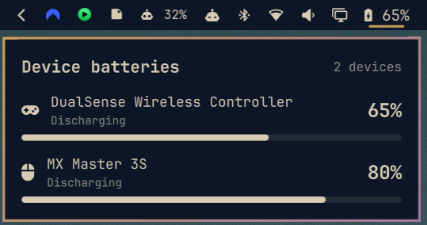

# Device Batteries

An Omarchy Shell bar widget that lists the battery level of connected external
devices, including Bluetooth devices and devices connected by cable.



## How it works

The widget reads `UPower.devices` first. UPower is the Linux service that
collects power telemetry from Bluetooth and USB/HID drivers, so it can report a
cabled mouse while it is charging as well as a wireless device. Connected BlueZ
devices provide a fallback only when UPower has no matching device, preventing
duplicate rows.

The widget cannot show a device whose Linux driver does not publish battery
telemetry to either UPower or BlueZ.

## Install

After this directory is committed to a Git repository, install it through the
supported Omarchy plugin command:

```bash
omarchy plugin add https://github.com/diegoalveslv/omarchy-device-batteries.git --enable
omarchy bar move dlv.device-batteries --section right --before omarchy.power
```

The Omarchy-managed checkout is placed under `~/.config/omarchy/plugins/` while
this repository can remain in your workspace. Do not edit
`/usr/share/omarchy/`.

## Remove

```bash
omarchy plugin remove dlv.device-batteries
```

## Usage

The widget is hidden when no external device reports a battery. Otherwise, the
bar shows a battery icon and the lowest connected-device charge. Click it to
open a per-device list with charge state.

It can also be toggled through Omarchy Shell IPC:

```bash
omarchy-shell shell toggle dlv.device-batteries '{}'
```

## Development checks

```bash
scripts/check
```

The checks run unit tests for the data-merging logic, validate the Omarchy
plugin manifest, and lint QML when `qmllint` is installed.

## Requirements

- Omarchy 4.0.2 or newer
- Quickshell 0.3.1 or newer
- UPower; BlueZ is optional and used only for its fallback

## License

[Apache License 2.0](LICENSE)
